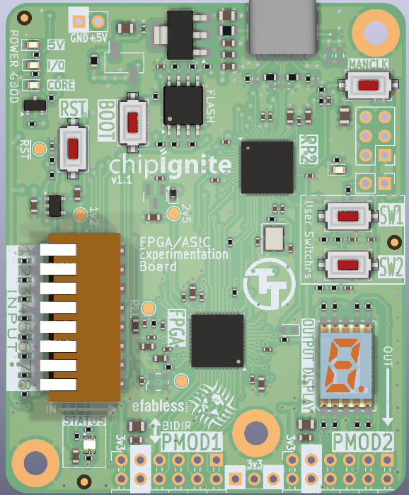
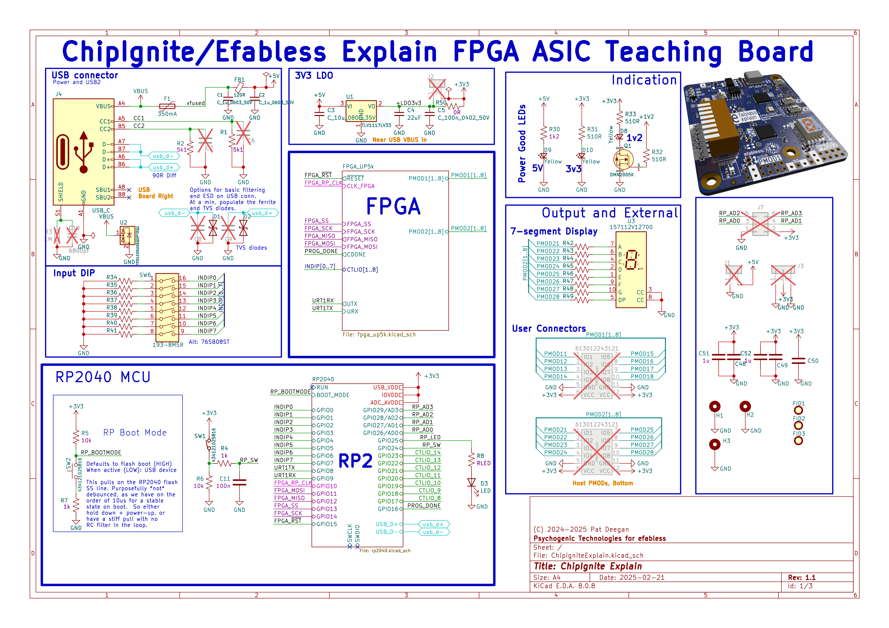

# ChipIgnite educational FPGA dev board

This FPGA experimentation and development board was developped for [efabless chipignite](https://efabless.com/chipignite) workshops and labs to serve as an easy to use experimentation board and stepping stone towards ASIC digital design, allowing for simple migration of design to [Tiny Tapeout](https://tinytapeout.com) projects.

 

It is released as [open hardware](LICENSE), and all the design files are included here, as a[kicad](https://www.kicad.org/) project.

## Schematic

The [full schematic pdf](docs/ChipigniteExplain-schematic.pdf) is available, but is in essence:

    *  An UP5K FPGA, tied to 8 input switches, 8 outputs through a 7-segment display and 8 additional I/O (the latter two sets also appearing on Pmod headers)
    
    *  An RP2040 MCU, used to manage bitstreams and allow for easy programming of FPGA through drag & drop of UF2 files on a virtual USB drive (powered by [riffpga](https://github.com/psychogenic/riffpga) ) 
    
